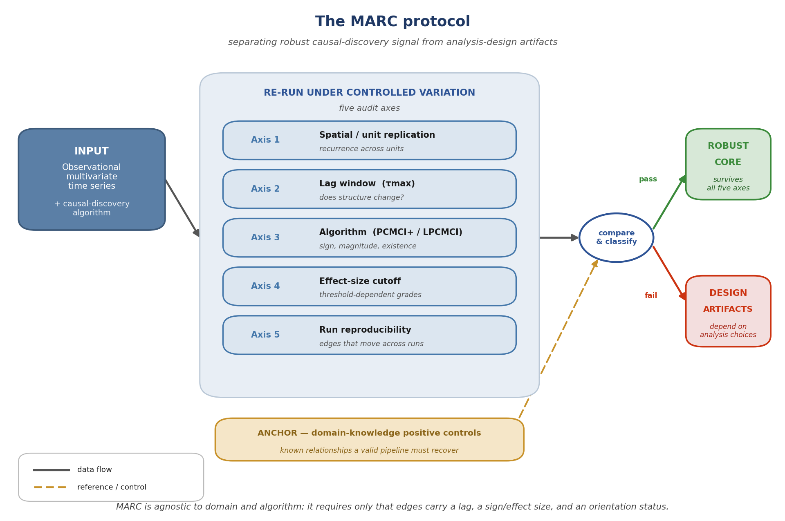

# MARC

MARC (Multi-Axis Robustness Check)는 관측 기반 다변량 시계열에서 인과 발견 결과가
분석 설계에 따라 흔들린 것인지, 여러 조건을 통과하는 견고한 신호인지 구분하기 위한
범용 재현성 점검 프로토콜입니다.

MARC는 특정 분야에 묶여 있지 않습니다. 변수명, 단위, 양성 대조군, 알고리즘, 시차 창,
효과크기 기준은 모두 하나의 YAML 설정 파일에서 연구자가 직접 지정합니다.

<p align="center">
  
</p>

[English](README.md) | 한국어

## 한 번의 명령으로 실행

저장소를 받은 뒤 환경을 만들고 패키지를 설치합니다.

```bash
conda create -n marc python=3.11 -y
conda activate marc
pip install -e .
```

연구 설정 파일을 준비합니다.

```bash
cp marc_config_template.yml marc_config.yml
```

그다음 다음 세 가지만 하면 됩니다.

1. 연구자가 직접 준비한 데이터셋을 `data/`에 넣습니다.
2. `marc_config.yml`에서 데이터 경로, 시간 열, 단위 열, 변수, 알고리즘, 기준값을 수정합니다.
3. 전체 프로토콜을 실행합니다.

```bash
marc run marc_config.yml
```

명령줄 진입점을 설치하지 않은 경우에는 다음처럼 실행할 수 있습니다.

```bash
python run_marc.py run marc_config.yml
```

이 명령은 다음 과정을 한 번에 수행합니다.

1. 단위별 다변량 시계열을 불러오고 검증합니다.
2. 단위, 시차 창, 알고리즘, 반복 실행 조건을 바꾸어 인과 발견을 재실행합니다.
3. 효과크기 cutoff별 재현성을 다시 계산합니다.
4. 분야 지식 기반 양성 대조군을 점검합니다.
5. 에지를 `robust_core`와 `design_artifact`로 분류합니다.
6. 표준 테이블, 그림 4개, 캐시된 실행 결과, manifest를 저장합니다.

## 입력 데이터 형식

연구자는 직접 준비한 wide-format CSV, Parquet, Excel 파일을 제공합니다. 이 저장소는
연구용 원자료를 포함하지 않으며, 어떤 데이터셋도 자동으로 선택하지 않습니다.

```text
time,unit,X,Y,Z
2025-01-01 00:00,A,...
2025-01-01 01:00,A,...
2025-01-01 00:00,B,...
```

`unit_column`은 선택 사항입니다. 이 열이 없으면 MARC는 전체 표를 하나의 시계열 단위로
처리합니다.

## 코드 구조

```text
src/marc/
  data.py       입력 및 검증
  engines.py    인과 발견 알고리즘 어댑터
  audit.py      다섯 축 점검 및 분류
  report.py     표, 그림, 실행 기록 저장
  cli.py        한 번의 명령 실행 흐름
```

## 알고리즘

기본 제공 알고리즘은 다음과 같습니다.

- Tigramite PCMCI+ with `ParCorr`
- Tigramite LPCMCI with `ParCorr`

사용자 정의 알고리즘은 adapter factory 방식으로 연결합니다.

```yaml
algorithms:
  - name: MyAlgorithm
    engine: my_package.my_adapter:create_engine
```

반환되는 engine은 다음 메서드를 구현해야 합니다.

```python
run(frame, tau_max, repeat, unit) -> pandas.DataFrame
```

MARC는 source, target, lag, orientation, effect size, 선택적 p/q value를 가진 표준화된
에지 테이블만 요구합니다.

## 데모

```bash
python examples/make_demo_data.py
python run_marc.py run examples/marc_demo.yml
```

Jupyter notebook은 의도적으로 얇게 유지했습니다. YAML 경로를 지정하고 단일 명령 셀을
실행하는 front end 역할만 합니다.

## 서울 대기질 사례 연구

`case_study_seoul/`은 MARC의 예시 적용 사례이며, 기본 입력 파이프라인이 아닙니다.
논문용 그림과 요약표만 포함하고, 원자료는 포함하지 않습니다. 서울시 원자료 안내는
[case_study_seoul/README.md](case_study_seoul/README.md)를 참고하세요.

## 저장소 구성

```text
data/                       연구자가 직접 넣는 데이터셋, Git 추적 제외
src/marc/                   재사용 가능한 MARC 구현
examples/                   합성 데이터 데모
case_study_seoul/           서울 대기질 사례 연구 그림과 요약표
MARC_one_command.ipynb      선택적 노트북 front end
marc_config_template.yml    연구 설정 템플릿
SKILL.md                    AI 코딩 에이전트와 CLI assistant용 안내
```

생성 산출물과 로컬 설정 파일은 Git에서 제외됩니다. 따라서 이 저장소는 사용자 개인 경로,
원자료, 로컬 실행 캐시를 공개하지 않습니다.

## 에이전트 안내

이 저장소에는 AI 코딩 에이전트와 CLI assistant를 위한 도구 중립형 안내서
[SKILL.md](SKILL.md)가 포함되어 있습니다. MARC 실행 흐름, 입력/출력 계약,
안전한 수정 원칙, smoke test 기준을 요약해 Codex, Claude, 터미널 에이전트,
사람 연구자가 같은 프로젝트 로직을 공유할 수 있게 했습니다.

## 라이선스와 데이터 이용 조건

MARC 소스코드는 MIT License로 공개합니다. 이 라이선스는 저장소의 코드와 문서에 적용되며,
외부 연구 데이터의 이용 조건을 대체하지 않습니다. 서울열린데이터광장 등 외부 제공처에서
받은 데이터는 해당 제공처의 이용 조건을 따라야 합니다.
